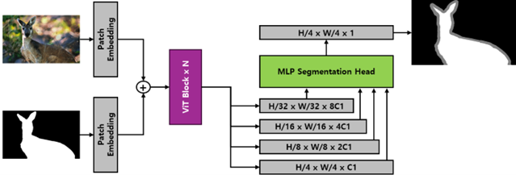

# [Transformer-based Trimap Segmentation]

**Division of Automotive Technology, DGIST**

2025

<p align="center">
  
</p>

## Overview

본 프로젝트는 Trimap 분할을 위한 Transformer 기반 모델을 개발하고, 기존의 인터랙티브 세그멘테이션 방식 대신 Segmentation Mask를 보조 입력으로 활용하는 새로운 구조를 제안합니다.
원래의 SimpleClick 모델을 기반으로 하여, 클릭 기반 입력이 아닌 segmentation mask를 patch embedding하여 transformer backbone에 통합하는 방식으로 수정되었습니다. 또한 binary segmentation이 아닌 **3-class Trimap (Foreground, Unknown, Background)**을 예측하도록 모델을 확장하였습니다.

## Key Modifications from SimpleClick
	•	**입력 변경**: 사용자의 클릭 대신, Segmentation Mask를 입력으로 사용.
	•	**Patch Embedding 추가**: Mask를 Patch Embedding하여 이미지 feature에 추가.
	•	**출력 변경**: 기존 binary segmentation → 3-class Trimap 예측 (foreground, unknown, background).
	•	**Loss 함수 변경**
    •	Normalized Focal Loss for Trimap prediction
    •	Unknown Region Distance Transform Loss
    •	CombinedLoss로 통합
	•	**Augmentation**
	  •	LongestMaxSize, PadIfNeeded, HorizontalFlip, RandomBrightnessContrast, RGBShift 적용

## Environment
	•	Python 3.8+
	•	PyTorch 2.4.1+cu121
  •	torchvision 0.19.1+cu121
	•	Ubuntu 20.04
	•	CUDA 12.1

```
pip3 install -r requirements.txt
```

## Download
	•	Train시에는 MAE pretrained weight를 다운로드 해야함 (Inference시에는 불 필요) : ViT-Huge Pretrain
  •	Inference & evaluation시에는 기존 학습된 weight를 다운로드해야함 : share/Trimap_pretrained_weight - Google Drive (무버스)
    •	./output/loss/composition_p3m10k_am2k_trimap_vit_huge448_focalloss_dtloss/001/checkpoints/
    •	위 경로에 다운로드 (필수 아님)
	•	데이터셋은 개별적으로 다운로드 필요 (Composition-1k, P3M-10k, AIM-500, AM-2k)
    •	Dataset 경로 : ./datasets/Seg2TrimapDataset
    •	위 경로에 @덕배가 정리한 데이터셋을 넣으면 됨
  •	추가로, MAE 사전 학습 가중치를 다운로드 받아야 합니다 (ViT-Huge 사용)

- MAE github : [MAE](https://github.com/facebookresearch/mae) 
- Pretrained weights (click to download: [ViT-Base](https://dl.fbaipublicfiles.com/mae/pretrain/mae_pretrain_vit_base.pth), [ViT-Large](https://dl.fbaipublicfiles.com/mae/pretrain/mae_pretrain_vit_large.pth), [ViT-Huge](https://dl.fbaipublicfiles.com/mae/pretrain/mae_pretrain_vit_huge.pth))


## Inference

모델 추론을 실행하려면 inference.py 파일을 사용하세요.
	•	inference.py 파일은 학습된 모델 체크포인트를 로드하고, 지정된 입력 이미지에 대해 Trimap 예측을 수행합니다.
	•	출력 결과는 지정된 디렉토리에 자동으로 저장됩니다.

```
python inference.py
```

## Evaluation

학습된 모델을 사용하여 Composition-1K, P3M-500-P, AIM-500, AM-200 데이터셋에 대해 평가할 수 있습니다.
```
python evaluation/eval.py
```

## Training

	•	학습 전 MAE 사전학습 가중치를 다운로드하고 경로를 설정해야 합니다.
	•	학습을 실행하려면 run_train.sh 파일을 사용하세요.
```
sh run_train.sh
```
	•	직접 python 코드를 실행하려면 아래 코드를 실행하세요. 
```
python train.py models/loss/trimap_huge448_nfl_dt_loss.py --batch-size=32 --ngpus=4 --upsample='x4'
```